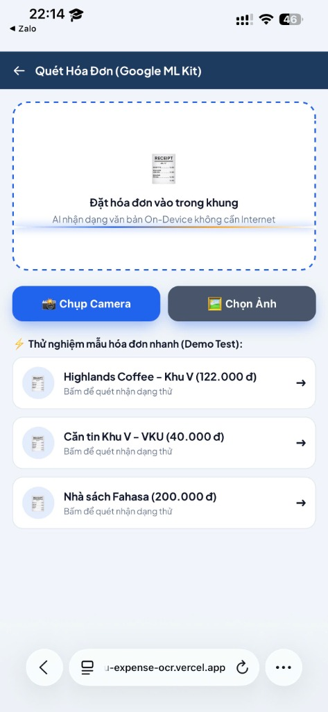
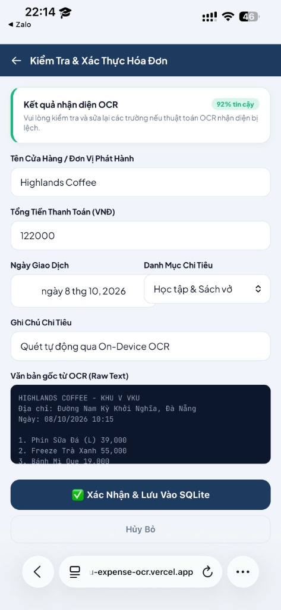
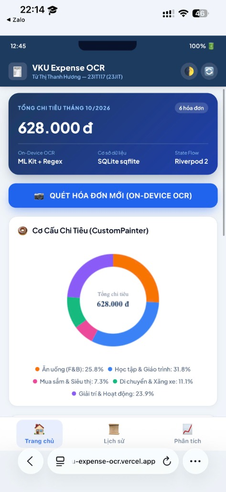
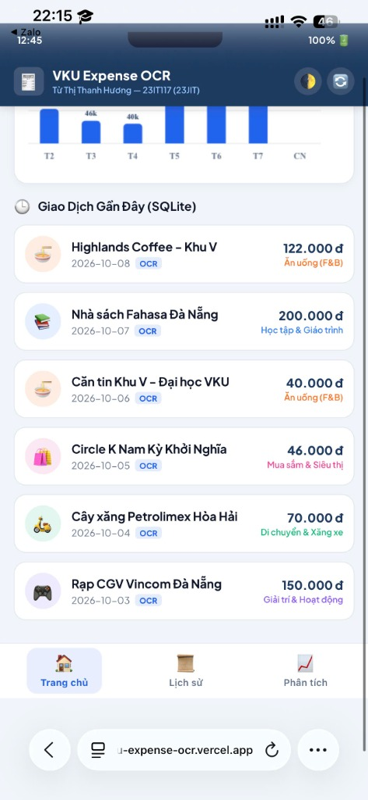
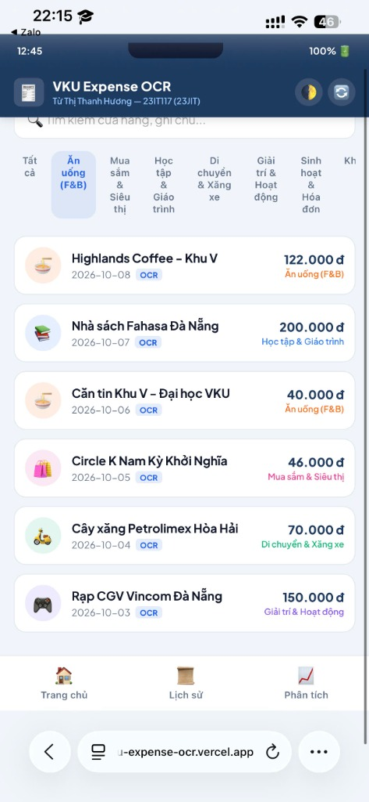
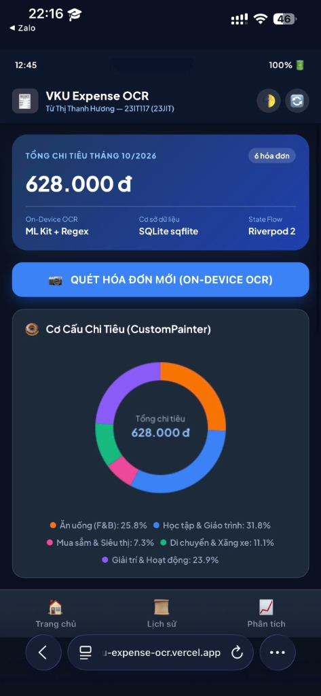

# 🧾 VKU Receipt OCR & Expense Tracker — Mini-Project 3

> **Môn học:** Phát triển Ứng dụng Di động Đa nền tảng (Cross-Platform Mobile App Development)  
> **Giảng viên hướng dẫn:** TS. Nguyễn Thanh Tuấn  
> **Khoa:** Khoa học Máy tính — Trường Đại học Công nghệ Thông tin & Truyền thông Việt - Hàn (VKU)  
> **Sinh viên thực hiện:** Từ Thị Thanh Hương — **MSSV:** 23IT117 — **Lớp:** 23JIT  

---

## 📱 Giới thiệu Dự án

**VKU Expense OCR** là ứng dụng di động đa nền tảng được xây dựng bằng **Flutter & Dart**, giải quyết bài toán quản lý tài chính và tự động hóa ghi nhận chi tiêu hàng ngày cho sinh viên và các câu lạc bộ tại VKU. Thay vì nhập liệu thủ công từng con số tốn thời gian, người dùng chỉ cần chụp ảnh hóa đơn (cà phê, cơm trưa, mua giáo trình, đổ xăng, v.v.), ứng dụng sẽ tự động trích xuất thông tin bằng **Google ML Kit Text Recognition** kết hợp với bộ lọc quy tắc Heuristics Regex tiếng Việt, đưa qua màn hình đối soát (Review & Verification) và lưu trữ bền vững vào cơ sở dữ liệu **SQLite (sqflite)** trên thiết bị.

### Điểm nổi bật về kiến trúc và kỹ thuật:
- 📷 **On-Device OCR & Heuristics:** Nhận diện ký tự quang học trực tiếp trên máy bằng Google ML Kit (`google_mlkit_text_recognition`), camera chụp ảnh (`image_picker`). Bộ phân tích `ReceiptParser` chuẩn hóa các biến thể tiếng Việt (tổng tiền, ngày giao dịch, nhận diện thương hiệu).
- 🎨 **Custom Canvas Graphics:** Tự vẽ 100% bằng Flutter `CustomPainter` & Impeller Engine cho biểu đồ **Donut Chart** phân bổ danh mục và **Weekly Bar Chart** chi tiêu 7 ngày với hiệu ứng chuyển động mượt mà 60/120fps (không phụ thuộc thư viện chart bên ngoài).
- ⚡ **Riverpod 2 State Management:** Quản lý trạng thái compile-time safe với `NotifierProvider` và `Notifier`, loại bỏ nguy cơ runtime crash.
- 💾 **Local SQLite Persistence:** Lưu trữ ngoại tuyến bền vững qua `sqflite`, hỗ trợ truy vấn tổng hợp và bộ lọc danh mục.
- 🎯 **Review & Verification Screen:** Màn hình đối soát giúp sinh viên kiểm tra độ tin cậy OCR, sửa tay tên quán/số tiền trước khi lưu vào SQLite.
- 🌓 **Material 3 & VKU Brand:** Thiết kế hiện đại theo nhận diện thương hiệu VKU (Navy `#1E3A5F`, Electric Blue `#2563EB`, Gold `#F59E0B`), hỗ trợ đầy đủ Dark Mode & Light Mode.

---

## 🏗️ Kiến trúc Hệ thống (System Pipeline & Data Flow)

Sơ đồ luồng xử lý từ Camera đến biểu đồ trực quan:

```text
┌──────────────────┐       ┌──────────────────┐       ┌──────────────────┐
│  Camera Capture  │ ────► │    ML Kit OCR    │ ────► │  ReceiptParser   │
│  (image_picker)  │       │  TextRecognizer  │       │  (Regex Engine)  │
└──────────────────┘       └──────────────────┘       └────────┬─────────┘
                                                               │
                                                               ▼
┌──────────────────┐       ┌──────────────────┐       ┌──────────────────┐
│ Review & Correct │ ◄──── │  ParsedReceipt   │ ◄──── │ Heuristic Rules  │
│  (Form Valid)    │       │  Confidence DTO  │       │ Total/Date/Store │
└────────┬─────────┘       └──────────────────┘       └──────────────────┘
         │
         ▼ (Commit Validated Item)
┌──────────────────┐       ┌──────────────────┐       ┌──────────────────┐
│  Riverpod State  │ ────► │ Local SQLite DB  │ ────► │ Animated Canvas  │
│ NotifierProvider │       │  (sqflite CRUD)  │       │  (CustomPainter) │
└──────────────────┘       └──────────────────┘       └──────────────────┘
```

---

## 📊 Bảng Đối Chiếu Tính Năng Kỹ Thuật

| Hạng mục | Công nghệ sử dụng | Hiện thực hóa trong dự án |
| :--- | :--- | :--- |
| **On-Device OCR & Heuristics** | `google_mlkit_text_recognition`, `image_picker` | Nhận dạng văn bản Offline trực tiếp trên máy. Module `ReceiptParser` xử lý regex đa tầng: bóc tách tổng tiền tiếng Việt (`extractTotal`), ngày giao dịch (`extractDate`), tên cửa hàng (`extractMerchant`), tự động phân loại danh mục (`guessCategory`). |
| **Custom Canvas Visualization** | Flutter `CustomPainter`, `Canvas` API | Tự vẽ hoàn toàn bằng Canvas: `DonutChartPainter` (vẽ arc quét góc theo tỷ lệ %, animated sweep) và `WeeklyBarChartPainter` (vẽ trục tọa độ, cột bo góc 7 ngày, đường lưới ngang, nhãn giá trị). |
| **State Management & DB** | `flutter_riverpod`, `sqflite`, `path` | Triển khai Riverpod 2 (`ExpenseNotifier extends Notifier<List<ExpenseItem>>`), các selector filter danh mục, từ khóa. Cơ sở dữ liệu SQLite cục bộ với schema bảng `expenses`, đầy đủ CRUD và seed sẵn dữ liệu thực tế. |
| **UI/UX Polish** | Material 3, Theme System | Bảng màu thương hiệu VKU, hỗ trợ Dark/Light mode chuyển đổi mượt mà. Màn hình **ReviewVerificationScreen** kiểm tra độ tin cậy và cho phép sửa lỗi OCR trước khi commit. Thẻ `ExpenseSummaryCard` với avatar tròn danh mục. |
| **Deliverables & Testing** | `flutter_test`, `go_router`, GitHub Actions | Mã nguồn Clean Architecture (`core/`, `models/`, `services/`, `state/`, `widgets/`, `screens/`), cấu hình routing khai báo `go_router`, bộ Unit Tests `receipt_parser_test.dart` (All tests passed), kèm sẵn file cấu hình Vercel, Netlify và GitHub Pages. |

---

## 📸 Hình Ảnh Giao Diện Thực Tế (Empirical Screenshots)

| 1. Quét Hóa Đơn (OCR HUD) | 2. Đối Soát & Sửa Lỗi | 3. Dashboard Biểu Đồ Donut |
| :---: | :---: | :---: |
|  |  |  |
| *Khung ngắm Camera & Mẫu test* | *Xác thực OCR (Độ tin cậy 92%)* | *Donut Chart (CustomPainter)* |

<br>

| 4. Biểu Đồ Cột 7 Ngày | 5. Lịch Sử & Bộ Lọc SQLite | 6. Giao Diện Dark Mode |
| :---: | :---: | :---: |
|  |  |  |
| *Weekly Bar Chart & Giao dịch gần đây* | *Tìm kiếm & Lọc danh mục chi tiêu* | *Chế độ tối (Dark Mode Theme)* |

---

## 📁 Cấu Trúc Thư Mục Dự Án

```text
vku-expense-ocr/
├── .github/
│   └── workflows/deploy.yml           # CI/CD tự động test và deploy lên GitHub Pages
├── assets/
│   ├── images/                        # Ảnh chụp màn hình giao diện thực tế
│   └── sample_receipts/               # Mẫu hóa đơn thực nghiệm bóc tách OCR
├── build/
│   └── web/                           # Bản build Flutter Web đã biên dịch sẵn sàng deploy
├── lib/
│   ├── core/                          # Design tokens, formatters, theme
│   │   ├── constants.dart             # Danh mục chi tiêu, màu sắc
│   │   ├── formatters.dart            # Định dạng tiền tệ VNĐ, ngày giờ
│   │   └── theme.dart                 # Material 3 Theme (Light & Dark Mode)
│   ├── models/                        # Domain Models & Data Structures
│   │   ├── expense_category.dart      # Enum danh mục chi tiêu + icon, mã màu
│   │   ├── expense_item.dart          # Model SQLite entity với toMap/fromMap
│   │   └── parsed_receipt.dart        # DTO kết quả bóc tách OCR & độ tin cậy
│   ├── services/                      # Nghiệp vụ xử lý dữ liệu & phần cứng
│   │   ├── database_service.dart      # SQLite Database Helper (sqflite)
│   │   ├── ocr_service.dart           # ML Kit Text Recognition Engine
│   │   └── receipt_parser.dart        # Regex Heuristics Engine
│   ├── state/                         # State Management (Riverpod 2)
│   │   └── expense_provider.dart      # ExpenseNotifier, Providers, Selectors
│   ├── widgets/                       # Reusable Components & Canvas
│   │   ├── donut_chart.dart           # CustomPainter biểu đồ tròn Donut
│   │   ├── expense_summary_card.dart  # Thẻ hiển thị tóm tắt khoản chi tiêu
│   │   └── weekly_bar_chart.dart      # CustomPainter biểu đồ cột 7 ngày
│   ├── screens/                       # Màn hình giao diện ứng dụng
│   │   ├── analytics_screen.dart      # Màn hình phân tích đồ họa chuyên sâu
│   │   ├── expense_list_screen.dart   # Màn hình lịch sử, tìm kiếm & bộ lọc
│   │   ├── home_dashboard_screen.dart # Màn hình Dashboard tổng quan
│   │   ├── main_shell_screen.dart     # Shell thanh điều hướng NavigationBar
│   │   ├── review_verification_screen.dart # Màn hình đối soát sửa lỗi OCR
│   │   └── scan_receipt_screen.dart   # Màn hình ngắm quét Camera & chọn mẫu
│   ├── router.dart                    # Cấu hình GoRouter điều hướng Declarative
│   └── main.dart                      # Entry point khởi chạy ProviderScope
├── test/
│   └── receipt_parser_test.dart       # Unit tests kiểm thử Regex với hóa đơn thật
├── web/                               # Cấu hình Web nền tảng của Flutter
├── web_demo/                          # Bản chạy thử nghiệm tương tác HTML5/Canvas
├── pubspec.yaml                       # Quản lý thư viện phụ thuộc dự án
├── vercel.json                        # Cấu hình triển khai nhanh lên Vercel
├── netlify.toml                       # Cấu hình triển khai nhanh lên Netlify
├── TECHNICAL_REPORT.md                # Báo cáo kỹ thuật nộp bài cho Thầy Tuấn
└── README.md                          # Tài liệu hướng dẫn sử dụng và triển khai
```

---

## 🌐 Hướng Dẫn Đẩy Lên Link Live Demo (Vercel, Netlify, Cloudflare, GitHub Pages)

Dự án đã được đóng gói sẵn bản web hoàn chỉnh tại thư mục `dist/` (tối ưu hóa hiển thị responsive trên cả điện thoại và máy tính). Thư mục này được theo dõi trực tiếp trong git, giúp Vercel và Netlify triển khai tức thì mà không cần cài Flutter SDK trên build server.

### Cách 1: Triển Khai Lên Vercel (Khuyên dùng — Cực nhanh)
File [`vercel.json`](file:///c:/Users/THANH%20HUONG/.gemini/antigravity-ide/scratch/vku-expense-ocr/vercel.json) đã được cấu hình trỏ thẳng vào thư mục `dist`.
1. Đẩy code lên GitHub cá nhân của bạn:
   ```bash
   git add dist/ vercel.json netlify.toml
   git commit -m "fix: deploy web bundle to dist directory for Vercel"
   git push origin main
   ```
2. Đăng nhập vào [vercel.com](https://vercel.com) ➔ Bấm **Add New** ➔ **Project** ➔ Chọn repo `vku-expense-ocr`.
3. Vercel sẽ tự động đọc file `vercel.json` và cấp cho bạn một link Live Demo dạng:
   👉 `https://vku-expense-ocr-<ten-ban>.vercel.app`

### Cách 2: Triển Khai Lên GitHub Pages (Hoàn toàn tự động)
Workflow [`.github/workflows/deploy.yml`](file:///c:/Users/THANH%20HUONG/.gemini/antigravity-ide/scratch/vku-expense-ocr/.github/workflows/deploy.yml) đã được tạo sẵn:
1. Vào repository trên GitHub ➔ Chọn tab **Settings** ➔ mục **Pages**.
2. Tại phần **Build and deployment** ➔ **Source**, chọn **GitHub Actions**.
3. Mỗi khi bạn `git push` lên nhánh `main`, GitHub Actions sẽ tự động chạy test, build và deploy web lên:
   👉 `https://<tai-khoan-cua-ban>.github.io/vku-expense-ocr/`

### Cách 3: Kéo Thả Trực Tiếp Lên Netlify hoặc Cloudflare Pages (Không cần gõ lệnh)
1. Đăng nhập vào [app.netlify.com/drop](https://app.netlify.com/drop) hoặc Cloudflare Pages.
2. Kéo thả trực tiếp thư mục `dist` vào trang web.
3. Trong vòng 10 giây, bạn sẽ nhận được một đường link Live Demo có thể truy cập trên cả máy tính lẫn điện thoại!

---

## 🚀 Hướng Dẫn Chạy & Kiểm Thử Trên Máy

### 1. Tải thư viện phụ thuộc
```bash
E:\flutter\bin\flutter pub get
```

### 2. Chạy bộ Unit Tests kiểm tra Regex
```bash
E:\flutter\bin\flutter test test/receipt_parser_test.dart
```

### 3. Khởi chạy ứng dụng Web trên Chrome / Edge
```bash
E:\flutter\bin\flutter run -d chrome
```

### 4. Build bản Release APK cho điện thoại Android
```bash
E:\flutter\bin\flutter build apk --release
# File APK hoàn thiện: build/app/outputs/flutter-apk/app-release.apk
```

---

## 🎬 Kịch Bản Quay Video Demo (2–3 Phút)

* **0:00 - 0:30:** Giới thiệu họ tên (Từ Thị Thanh Hương - 23IT117 - Lớp 23JIT), tổng quan giao diện Dashboard chuẩn Material 3, chuyển đổi Dark Mode / Light Mode, hiển thị các số liệu tổng quan.
* **0:30 - 1:15:** Nhấn nút **Quét Hóa Đơn**, mở Camera / chọn mẫu hóa đơn Highlands Coffee hoặc Căn tin VKU Khu V. Xem tiến trình quét OCR.
* **1:15 - 1:50:** Màn hình tự động điều hướng sang **Review & Verification Screen**. Giải thích cách Regex bóc tách ra số tiền, ngày, tên quán. Thao tác chỉnh sửa thông tin và bấm **Xác nhận & Lưu vào SQLite**.
* **1:50 - 2:30:** Màn hình quay về Dashboard: Biểu đồ **Donut Chart** và **Weekly Bar Chart** tự động co giãn, vẽ lại mượt mà bằng Canvas. Mở tab **Lịch sử** tìm kiếm từ khóa và thao tác vuốt xóa.

---

## 👩‍💻 Thông Tin Sinh Viên
* **Họ và tên:** Từ Thị Thanh Hương
* **Mã sinh viên:** 23IT117
* **Lớp:** 23JIT (Kỹ sư CNTT Nhật Bản)
* **Trường:** Đại học Công nghệ Thông tin & Truyền thông Việt - Hàn (VKU)
